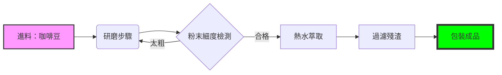

```mermaid
graph LR
    A[進料：咖啡豆] --> B(研磨步驟)
    B --> C{粉末細度檢測}
    C -- 太粗 --> B
    C -- 合格 --> D[熱水萃取]
    D --> E[過濾殘渣]
    E --> F[包裝成品]
    
    style A fill:#f9f,stroke:#333,stroke-width:2px
    style F fill:#00ff00,stroke:#333,stroke-width:4px
```
